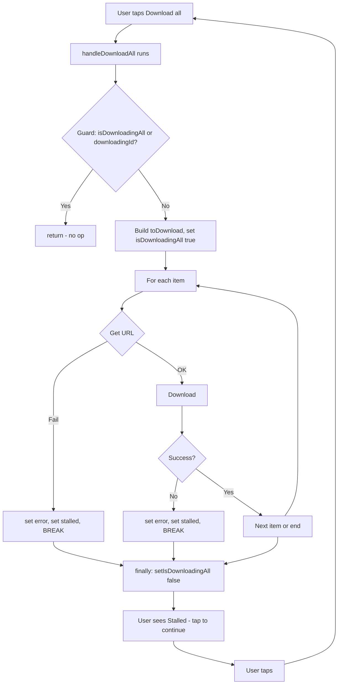

# Fix Crystal Bowl Solar URL and Stalled "Tap to Continue"

## Part 1: Crystal Bowl Solar URL (on-screen error)

### Root cause

The app requests `crystal_Bowl_Meditation_Audio/Day3_528hz_CrystalBowl_1Hour_SoundBath.aac` from Firebase Storage. Firebase returns object-not-found (404). The verified filename in Storage (per [docs/archive/AUDIO_PATH_VERIFICATION_REPORT.md](docs/archive/AUDIO_PATH_VERIFICATION_REPORT.md)) is `Day3_528hz_CrystalBowlMeditation_FrequencyHealing.aac`.

### Change

Update the expected crystal bowl filename for SOLAR_PLEXUS to match Storage in:

- [hooks/useCrystalBowlAudio.ts](hooks/useCrystalBowlAudio.ts): `CHAKRA_TO_CRYSTAL_BOWL_FILE[Chakra.SOLAR_PLEXUS]` and top-of-file comment
- [src/utils/audioPreloadManifest.ts](src/utils/audioPreloadManifest.ts): `CRYSTAL_BOWL_FILES[Chakra.SOLAR_PLEXUS]`
- [constants/firebaseStoragePaths.ts](constants/firebaseStoragePaths.ts): comment listing the 7 files

Use filename: `Day3_528hz_CrystalBowlMeditation_FrequencyHealing.aac`.

---

## Part 2: Stalled — tap to continue (end-to-end)

### Root cause

When download-all hits an error (e.g. URL failure or download failure), the code sets `setDownloadAllStalled(true)` but **does not exit** the for loop; it uses `continue`. So:

1. The UI shows "Stalled — tap to continue" and "Last error: ...".
2. The same async run of `handleDownloadAll` is still in progress (moving on to the next item or awaiting a long download).
3. `isDownloadingAll` stays `true` until the run reaches the `finally` block.
4. When the user taps, `handleDownloadAll` is called again. The guard at the top is `if (isDownloadingAll || downloadingId) return`, so the second call **returns immediately** and the tap does nothing.
5. If the next item after the failed one is slow (e.g. 5 min crystal bowl timeout) or hangs, the user stays stuck: "Stalled" is shown but tap has no effect until the entire loop eventually finishes.

So "tap to continue" does not work because the run never ends when we stall; the guard blocks retry until the run ends.

### Intended behavior

On any error that we surface to the user (set `downloadAllStalled(true)`), **stop the batch** so that:

- The run exits the loop and hits `finally` → `setIsDownloadingAll(false)`.
- The user can tap again; the guard passes and `handleDownloadAll` runs again (retry remaining items).

### Change in [app/(chakras)/AudioLibrary.tsx](app/(chakras)/AudioLibrary.tsx)

In `handleDownloadAll`, inside the `for` loop:

1. **URL resolution failure** (after the `if (!url)` block, around line 849): After `setDownloadAllLastError(...)` and `setDownloadAllStalled(true)`, **break** instead of **continue** so the loop exits and `finally` runs.
2. **Download failure** (in the `catch` block for the try that does `downloadAndCacheAudioResumableWithTimeout` / `downloadAndCacheAudio`, around line 881): After `setDownloadAllLastError(msg)` and `setDownloadAllStalled(true)`, **break** out of the for loop (e.g. by adding a `break` after the catch block, or using a flag and breaking at the end of the iteration). So on first error we stop the batch and let the user tap to retry.

No change to the outer catch or finally; they already set stalled and clear `isDownloadingAll` as needed.

### Flow after fix

Once the run has exited (after break or normal completion), `isDownloadingAll` is false, so the next tap runs `handleDownloadAll` again and retries (remaining items; crystal bowl solar will succeed after Part 1).

---

## Verification

1. **Crystal bowl solar:** Open Audio Library (Frequency of Gnosis), confirm solar crystal bowl row and download-all no longer show "Could not get URL for crystal_bowl_solar_...".
2. **Stalled / tap to continue:** Trigger a failure (e.g. temporarily break one URL or disconnect), confirm "Stalled — tap to continue" appears, tap the row, confirm download-all runs again (e.g. "Downloading X of Y" or completion) instead of ignoring the tap.
